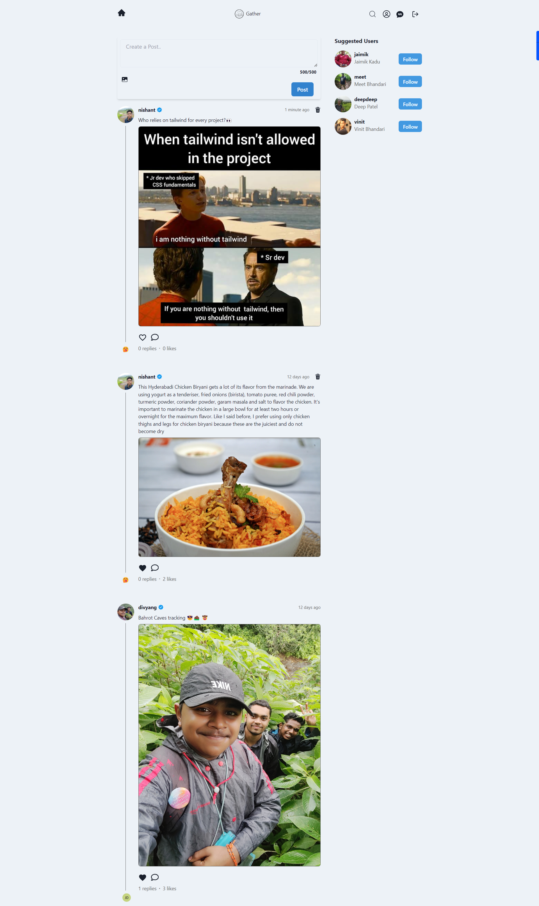

# Gather - Social Media and Chat App

## Your Social Pulse with Live Messaging!

Dive into the heartbeat of real-time connectivity with Gather, a dynamic microblogging platform featuring live messaging powered by socket.io. Here's why Gather is the ultimate destination for instantaneous connections:

**Short, Snappy Conversations:** Elevate your dialogue with bite-sized posts. Express yourself in 500 characters or less, keeping the conversation flowing.

📸 **Visual Storytelling:** Speak volumes with visuals. Share images to add an extra layer of expression to your tweets and captivate your audience.

👥 **Connect Beyond Boundaries:** Engage instantly with followers, friends, and community members by seamlessly following them.

💬 **Live Messaging Unleashed:** Break free from delays and embrace the speed of real-time conversations. Gather's live messaging, powered by socket.io, ensures instant interactions that keep you engaged with your community.

📸 **Visual Messaging:** Elevate your live chats with real-time visual elements. Share images to add a dynamic flair to your conversations.

### Technology Used:

- React
- Chakra UI
- Tailwind CSS
- Socket.IO for real-time communication
- NodeJS/Express server
- MongoDB database
- JWT Authentication

### Screenshots:

1. **Signup Page**
   - Users need to submit a unique username and email while signing up.
   

2. **Login Page**
   

3. **Home Page**
   - View posts from your network.
   - Follow new users from the sidebar.
   - Create new posts from the Create Post Block.
   - Like and reply to posts on your feed.
   

4. **Single Post**
   - Like and reply to individual posts.
   

5. **Conversation Page**
   - Search for new users or chat with existing ones.
   

6. **Chat Page**
   - Open chat component for live conversations.
   - Send text messages or images to friends.
   

7. **Search User**
   - Search users by username, email, or name.
   - Backend-powered search.
   

8. **User Profile**
   - View profile details and own posts.
   - Create or delete posts.
   

9. **Update Profile**
    - Update user information on the profile page.
   